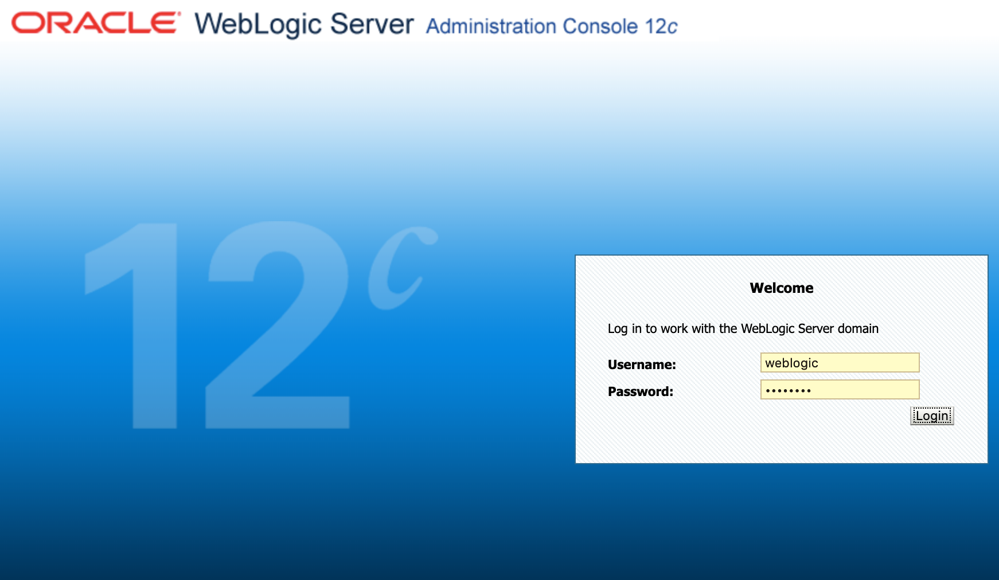
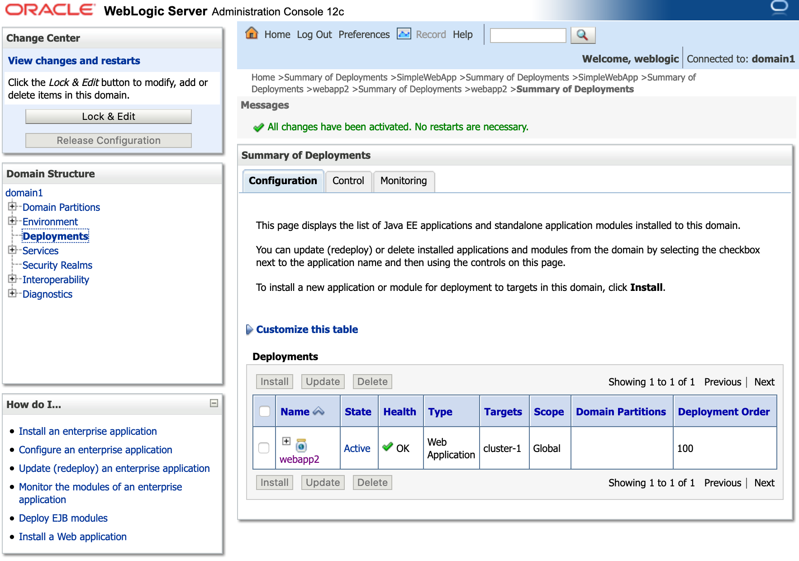

# Oracle WebLogic 12c runs on OpenShift 4.x

## Prerequisites
* git client
* helm client
* openshift command line - oc
* docker

## Steps
1. Get WebLogic Kubernetes Operator from Oracle's github (I'm using the version 2.5)
2. Install the operator to OpenShift 4.x via helm
3. Prepare your WebLogic container image with domain home by yourself or download an existing one
4. Expose your endpoint to public network


## Get WebLogic Kubernetes Operator from Oracle's github
```
git clone https://github.com/oracle/weblogic-kubernetes-operator
```

### Log into OpenShift cluster

<p><code>$ oc login https://api.cluster-xxxx.xxxx.openshift.com:6443</code><br/>
Authentication required for https://api.cluster-xxxx.xxxx.openshift.com:6443:6443 (openshift)<br/>
Username: admin<br/>
  Password: <strong><em>&lt;password&gt;</em></strong><br/>
Login successful.<br/>

<p>You have access to 56 projects, the list has been suppressed. You can list all projects with 'oc projects'<br/>
Using project "default".<br/>

---

### Create a new project - weblogic
<code>$ oc new-project weblogic</code>
<p/>Now using project "weblogic" on server "https://api.cluster-xxxx.xxxx.openshift.com:6443:6443".<br/>
You can add applications to this project with the 'new-app' command. For example, try:
<p/>
    <code>oc new-app django-psql-example</code>
<p/>
to build a new example application in Python. Or use kubectl to deploy a simple Kubernetes application:
<p/>
    <code>kubectl create deployment hello-node --image=gcr.io/hello-minikube-zero-install/hello-node</code>

<p/>
Then I will use helm to install the operator and it will install the Tiller in the cluster. Before that, I have to grant the privilige to the user <em>system:serviceaccount:kube-system:default</em>

```
cat << EOF | oc apply -f -
apiVersion: authorization.openshift.io/v1 
kind: ClusterRoleBinding
metadata:
  name: tiller-cluster-admin
roleRef:
  name: cluster-admin
subjects: 
- kind: ServiceAccount
  name: default
  namespace: kube-system
userNames:
- system:serviceaccount:kube-system:default
EOF
```

**clusterrolebinding.authorization.openshift.io/tiller-cluster-admin created**

### helm initialize - Install Tiller
<code>$ helm init</code><br/>

<strong>$HELM_HOME has been configured at /Users/dyangcht/.helm.
<p/>
Tiller (the Helm server-side component) has been installed into your Kubernetes Cluster.
<p/>
Please note: by default, Tiller is deployed with an insecure 'allow unauthenticated users' policy.<br/>
To prevent this, run `helm init` with the --tiller-tls-verify flag.<br/>
For more information on securing your installation see: https://docs.helm.sh/using_helm/#securing-your-helm-installation<br/>
Happy Helming!</strong><br/>

### Check the status
```
$ oc get deployments -n kube-system
NAME            READY   UP-TO-DATE   AVAILABLE   AGE
tiller-deploy   1/1     1            1           13m
```

Prepare your own YAML configuration file. Copy the original YAML file to a new one.
```
$ cp kubernetes/charts/weblogic-operator/values.yaml my-operator-values.yaml
```

Because I create a project called **"weblogic"**, I need to change the ***domainNamespaces*** from "default" to "weblogic" in my-perator-values.yaml.

```
$ oc adm policy add-scc-to-user anyuid -z default
```
**securitycontextconstraints.security.openshift.io/anyuid added to: ["system:serviceaccount:weblogic:default"]**

```
$ helm install kubernetes/charts/weblogic-operator \
     --name weblogic-operator \
     --namespace weblogic \
     --values my-operator-values.yaml \
     --wait

NAME:   weblogic-operator
LAST DEPLOYED: Sun Apr 19 11:51:06 2020
NAMESPACE: weblogic
STATUS: DEPLOYED

RESOURCES:
==> v1/ClusterRole
NAME                                                   AGE
weblogic-weblogic-operator-clusterrole-domain-admin    49s
weblogic-weblogic-operator-clusterrole-general         49s
weblogic-weblogic-operator-clusterrole-namespace       49s
weblogic-weblogic-operator-clusterrole-nonresource     49s
weblogic-weblogic-operator-clusterrole-operator-admin  49s

==> v1/ClusterRoleBinding
NAME                                                          AGE
weblogic-weblogic-operator-clusterrolebinding-auth-delegator  49s
weblogic-weblogic-operator-clusterrolebinding-discovery       49s
weblogic-weblogic-operator-clusterrolebinding-general         49s
weblogic-weblogic-operator-clusterrolebinding-nonresource     49s

==> v1/ConfigMap
NAME                  DATA  AGE
weblogic-operator-cm  4     49s

==> v1/Deployment
NAME               READY  UP-TO-DATE  AVAILABLE  AGE
weblogic-operator  1/1    1           1          49s

==> v1/Pod(related)
NAME                                READY  STATUS   RESTARTS  AGE
weblogic-operator-6796b6c549-ln8qz  1/1    Running  0         49s

==> v1/Role
NAME                    AGE
weblogic-operator-role  49s

==> v1/RoleBinding
NAME                                     AGE
weblogic-operator-rolebinding            49s
weblogic-operator-rolebinding-namespace  49s

==> v1/Secret
NAME                       TYPE    DATA  AGE
weblogic-operator-secrets  Opaque  1     49s

==> v1/Service
NAME                            TYPE       CLUSTER-IP     EXTERNAL-IP  PORT(S)   AGE
internal-weblogic-operator-svc  ClusterIP  172.30.87.218  <none>       8082/TCP  49s
```     

* Check the status
```
$ oc get pods
NAME                                 READY   STATUS    RESTARTS   AGE
weblogic-operator-6796b6c549-ln8qz   1/1     Running   0          2m55s
```

Generate a secret for Weblogic's admin
```
$ ./kubernetes/samples/scripts/create-weblogic-domain-credentials/create-weblogic-credentials.sh \
   -u weblogic \
   -p welcome1 \
   -d domain1 \
   -n weblogic

secret/domain1-weblogic-credentials created
secret/domain1-weblogic-credentials labeled
The secret domain1-weblogic-credentials has been successfully created in the weblogic namespace.
```

* Check status
```
$ oc get secret domain1-weblogic-credentials

NAME                           TYPE     DATA   AGE
domain1-weblogic-credentials   Opaque   2      68s
```

### Build your own WebLogic container image

* Download the base image from Oracle
```
$ docker pull container-registry.oracle.com/middleware/weblogic:12.2.1.3
```

After download the base image, you need to change some parameters you need.
```
$ cd kubernetes/samples/scripts/create-weblogic-domain/domain-home-in-image
$ cp create-domain-inputs.yaml my.yaml
$ vi my.yaml
  namespace: weblogic
```

* Make your own image
```
$ ./create-domain.sh -u weblogic -p welcome1 -i my.yaml -o output

Input parameters being used
export version="create-weblogic-sample-domain-inputs-v1"
export adminPort="7001"
export adminServerName="admin-server"
export domainUID="domain1"
export serverStartPolicy="IF_NEEDED"
export clusterName="cluster-1"
export configuredManagedServerCount="5"
export initialManagedServerReplicas="2"
export managedServerNameBase="managed-server"
export managedServerPort="8001"
export productionModeEnabled="true"
export imagePullPolicy="IfNotPresent"
export weblogicCredentialsSecretName="domain1-weblogic-credentials"
...
...
...
Create domain domain1 successfully.

Domain domain1 was created and will be started by the WebLogic Kubernetes Operator

The following files were generated:
  output/weblogic-domains/domain1/create-domain-inputs.yaml
  output/weblogic-domains/domain1/domain.yaml

Completed
```

* Re-tag it and push to a container registry you have privilege
```
$ docker tag domain-home-in-image:12.2.1.3 dyangcht/wls:12.2.1.3-home
$ docker push dyangcht/wls:12.2.1.3-home
```

* Put the annotation of the anyuid after the parameter **serverPod** 
``` 
$ cd output/weblogic-domains/domain1/
$ vi domain.yaml

  serverPod:
    annotations:
      openshift.io/scc: anyuid
```

* Create the WebLogic domain
```
$ oc create -f domain.yaml 
domain.weblogic.oracle/domain1 created
```

* Check status
```
$ oc get pods
NAME                                  READY   STATUS    RESTARTS   AGE
domain1-introspect-domain-job-wbxfz   1/1     Running   0          58s
weblogic-operator-6796b6c549-ln8qz    1/1     Running   0          28m
```

* Waiting for the all servers are started, like following
```
$ oc get pods
NAME                                 READY   STATUS    RESTARTS   AGE
domain1-admin-server                 1/1     Running   0          3m48s
domain1-managed-server1              1/1     Running   0          117s
domain1-managed-server2              1/1     Running   0          117s
weblogic-operator-6796b6c549-ln8qz   1/1     Running   0          32m
```

* Expose them to a public domain
```
cat << EOF | oc apply -f -
apiVersion: extensions/v1beta1
kind: Ingress
metadata:
  name: pathrouting-1
  namespace: weblogic
  annotations:
    kubernetes.io/ingress.class: pathrouting
spec:
  rules:
  - host: domain1-ingress-lb.apps.cluster-xxx.xxx.openshift.com
    http:
      paths:
      - path: /
        backend:
          serviceName: domain1-cluster-cluster-1
          servicePort: 8001
      - path: /console
        backend:
          serviceName: domain1-admin-server
          servicePort: 7001          
EOF
ingress.extensions/pathrouting-1 created
```

* Check status
```
oc get routes
NAME                  HOST/PORT                                                          PATH       SERVICES                    PORT   TERMINATION   WILDCARD
pathrouting-1-5b9cd   domain1-ingress-lb.apps.cluster-xxx.xxx.openshift.com   /console   domain1-admin-server        7001                 None
pathrouting-1-w8wjp   domain1-ingress-lb.apps.cluster-xxx.xxx.openshift.com   /          domain1-cluster-cluster-1   8001                 None
```


* Open your browser and use the DNS name as above + /console to check the WebLogic Administration Console



* Deploy the webapp2.war


* After log into WebLogic Admin Console, you can deploy the sample web application and test it. The http request will be redirect to the WebLogic Cluster using the round-robin rule

```
$ curl http://domain1-ingress-lb.apps.cluster-xxx.xxx.openshift.com/webapp2/
<!DOCTYPE html>
<html>
  <head>
    <meta http-equiv="Content-Type" content="text/html; charset=UTF-8">
    
    <meta http-equiv="Cache-Control" content="no-cache, no-store, must-revalidate" />
<meta http-equiv="Pragma" content="no-cache" />
<meta http-equiv="Expires" content="0" />
    <title>Test WebApp</title>
  </head>
  <body>
      version 1.3<br/>

    

    <li>InetAddress: domain1-managed-server1/10.128.2.35
    <li>InetAddress.hostname: domain1-managed-server1

  </body>
</html>

$ curl http://domain1-ingress-lb.apps.cluster-xxx.xxx.openshift.com/webapp2/
<!DOCTYPE html>
<html>
  <head>
    <meta http-equiv="Content-Type" content="text/html; charset=UTF-8">
    
    <meta http-equiv="Cache-Control" content="no-cache, no-store, must-revalidate" />
<meta http-equiv="Pragma" content="no-cache" />
<meta http-equiv="Expires" content="0" />
    <title>Test WebApp</title>
  </head>
  <body>
      version 1.3<br/>

    

    <li>InetAddress: domain1-managed-server2/10.128.2.34
    <li>InetAddress.hostname: domain1-managed-server2

  </body>
</html>
```

